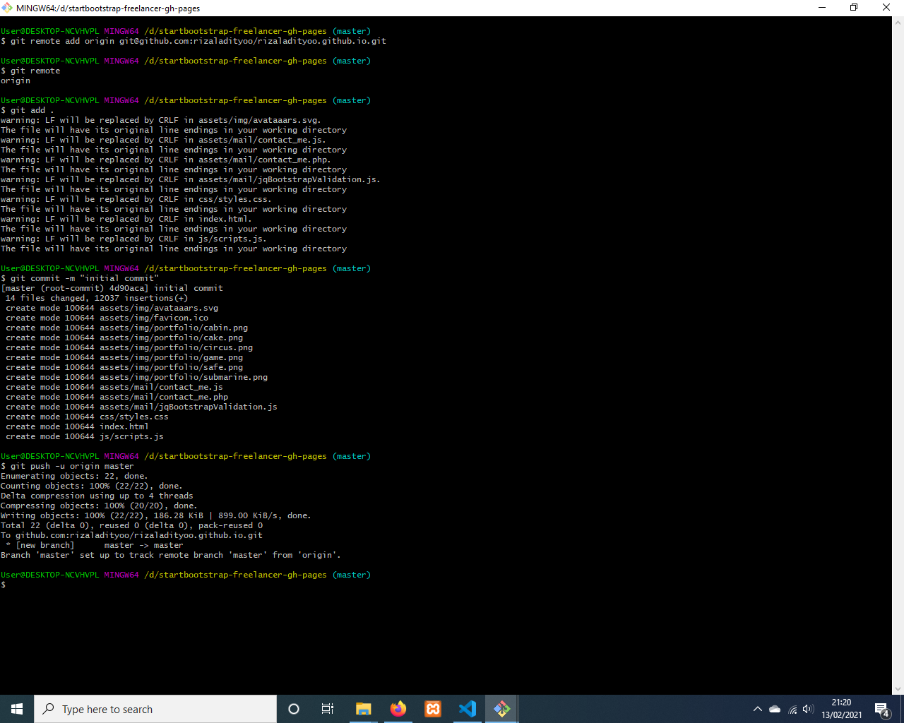
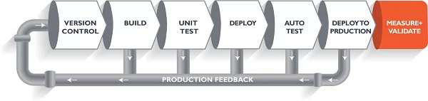

# bootcamp-devops
sistem operasi windows

1. DevOps adalah istilah untuk sebuah kultur dimana tim Developer dan tim Operation bekerja sama dalam proses development sebuah aplikasi agar lebih cepat dan efisien. 
Penting untuk mempersingkat proses development agar tidak terjadi delay antara team developer dan operation, untuk memperpendek waktu server tidak bisa diakses karena kesulitan menangani bug atapun versioning.
Alur kerja
    - Developer menulis kode secara lokal di laptop
    - Developer mengupload kode ke server Test
    - QA/Tester melakukan pengecekan. Gagal. Tester melapor ke Developer
    - Developer melakukan Rollback
    - Developer menulis kode secara lokal di laptop
    - Developer mengupload kode ke server Test
    - QA/Tester melakukan pengecekan. Berhasil
    - Developer mengupload kode ke Server Production
 (sumber https://blog.cilsy.id/2018/07/apa-itu-devops.html)

2. aws platform yang dapat melakukan hampir semua jenis proses, bukan open source, on-demand cloud computing 
   openstack platform tempat kita dapat melakukan tugas-tugas yang disediakan aws, opensource, IaaS cloud computing
sumber (https://www.geeksforgeeks.org/aws-vs-openstack/)
3. Git adalah salah satu sistem pengontrol versi (Version Control System) pada proyek perangkat lunak yang diciptakan oleh Linus Torvalds.
Pengontrol versi bertugas mencatat setiap perubahan pada file proyek yang dikerjakan oleh banyak orang maupun sendiri.
Git dikenal juga dengan distributed revision control (VCS terdistribusi), artinya penyimpanan database Git tidak hanya berada dalam satu tempat saja.

Semua orang yang terlibat dalam pengkodean proyek akan menyimpan database Git, sehingga akan memudahkan dalam mengelola proyek baik online maupun offline.
4. karena apabila tidak ada ci/cd proses development aplikasi akan cenderung lebih lambat dan juga kurang praktis 
5. Chef  procedural style
   Ansible prosedural style
   puppet declarative style
   terraform declarative style
  (sumber https://www.ibm.com/cloud/blog/chef-ansible-puppet-terraform)
6. HTTP : Pertama, klien (HTTP klien) membuat sambungan, 
          lalu mengirimkan permintaan dokumen ke web server.
          HTTP server kemudian memproses permintaan klien, setelah itu HTTP klien menunggu respon dari server tersebut.
          Selanjutnya web server merespon permintaan dengan kode status data, 
          selanjutnya menutup sambungan ketika telah selesai memproses permintaan.
   Load Balance : saat client melakukan request ke server load balance membagi beban baik dari sisi client maupun server
sumber (https://idcloudhost.com/mengenal-http-dan-fungsi-manfaat-dan-cara-kerja-untuk-website/)
7. kibana, Nagios, Cacti, Munin, Zabbix (sumber https://mebiso.com/5-aplikasi-pilihan-untuk-monitoring-server/)
8. proyek website statis yang sudah ada atau sudah di download kemudian pada folder tersebut ikuti langkah-langkah ini  (sumber https://www.youtube.com/watch?v=hHbWF1Bvgf4)

(sumber attach image https://www.youtube.com/watch?v=nvPOUdz5PL4)